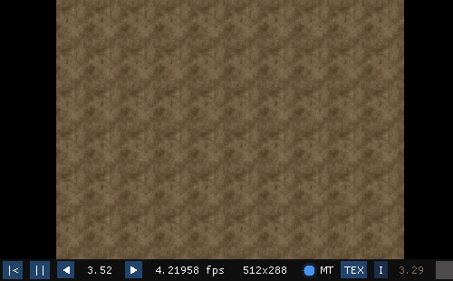
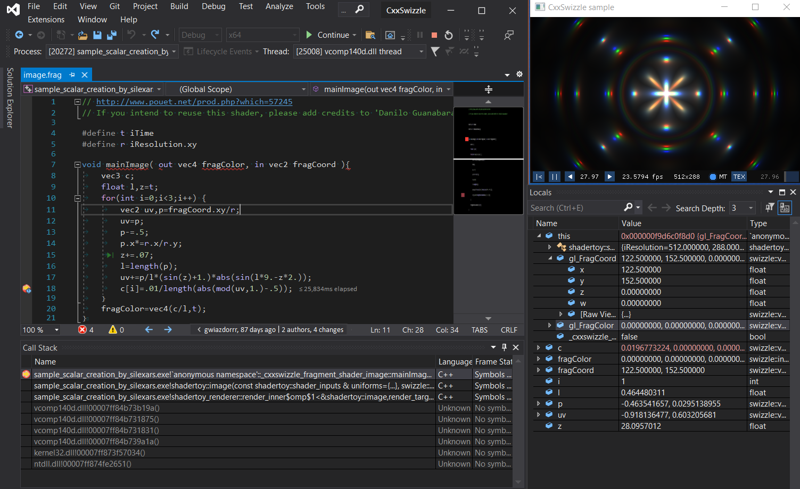

# CxxSwizzle


This project lets you download and run GLSL [shadertoys](https://www.shadertoy.com/) as C++17 code. Out of 1000 top shadertoys (on 26.11.2021), 840 compile without any code alterations and 953 compile if code patching is enabled. Code after patching is still GLSL-compatible and can be pasted back to the Shadertoy.

Here is the brilliant ["DooM" shadertoy port by P_Malin](https://www.shadertoy.com/view/lldGDr), run as C++ code.


Another example, ["Creation" by Danilo Guanabara](https://www.shadertoy.com/view/XsXXDn), being debugged in Visual Studio:


The repository is structured in the following way:
* `include`: header-only, dependency free headers that replicate GLSL syntax, types and built-in functions in C++, as completely as humanely possible. If you wish to use `CxxSwizzle` in your project, this directory is all you need.
* `sandbox_template`: a cross-platform shadertoy sandbox project template, using `SDL2`, `Dear ImGui`, [imgui-sdl](https://github.com/Tyyppi77/imgui_sdl) and optionally [Vc](https://github.com/VcDevel/Vc) (not to be confused with `VC++`/`MSVC`). `vcpkg` is used to resolve the dependencies. Shared by the samples and downloaded shadertoys.
* `samples`: a set of some of the best shadertoys, with a license permissive enough to have them included here.
* `shadertoys`: placeholder directory where shadertoys are downloaded to
* `textures`: placeholder directory where textures are downloaded to
* `test`: test project 
* `cmake` : some very painfully concieved CMake macros that download shaders using Shadertoy API and apply tivial code fixes, if enabled. Uses [json-cmake](https://github.com/sbellus/json-cmake).

## Setup

1. Clone the repository
```
git clone https://github.com/gwiazdorrr/CxxSwizzle.git
```
2. Init vcpkg and imgui_sdl submodules
```
git submodule update --init
```
3. Configure with CMake toolchain file and a generator of your choice. For example, using `ninja`:
```
cmake -G Ninja -B build -DCMAKE_TOOLCHAIN_FILE=vcpkg/scripts/buildsystems/vcpkg.cmake
cd build
ninja
```
If you are using CMake GUI, after clicking `Configure` select `Specify toolchain file for cross-compiling` and make sure the path in the next window points to `vcpkg/scripts/buildsystems/vcpkg.cmake`.


## Downloading shadertoys

**TL;DR:** set `SHADERTOY_DOWNLOAD` to any of `top_*` options and run `cmake`.

Downloading shadertoys takes place in CMake's configure step (not great, not terrible). Note that only shadertoys with `public+api` visibility can be downloaded this way. The process in controlled with following variables:

* `SHADERTOY_DOWNLOAD` controls the download process. If set to `id`, `SHADERTOY_DOWNLOAD_PARAM` is interpreted as a list of shadertoy IDs (semicolon-separated). If set to `top_*`, `SHADERTOY_DOWNLOAD_PARAM` is interpreted as a search term. The parameter is forcefully set to `none` after the download is done, to avoid redownloading same shaders during next CMake's configure phase.
* `SHADERTOY_DOWNLOAD_PARAM` either a semicolon-separated list of IDs or a search term
* `SHADERTOY_DOWNLOAD_MAX_COUNT` specifies the upper limit of how many shadertoys to download.
* `SHADERTOY_ROOT` a directory where shadertoys are downloaded to (`./shadertoys` by default)
* `SHADERTOY_TEXTURES_ROOT` a directory where textures are downloaded to (`./textures` by default)
* `SHADERTOY_APPLY_TRIVIAL_FIXES` can be cheched to avoid headaches with most common GLSL to C++ problems. 
* `SHADERTOY_API_KEY` (advanced) is the API key used to access Shadertoy API. If the default key gets rate-limited, you will need to create your own [key](https://www.shadertoy.com/howto#q2) and set the parameter.
* `SHADERTOY_SETUP` (advanced) specifies which sandbox setup to use. The default one (`scalar`) has no support for partial derivatives, but branches/loop work out of the box. If you are feeling adventurous check out `simd` variants.

### Use case: download specific shadertoys

1. Set `SHADERTOY_DOWNLOAD` to `id`
2. Set `SHADERTOY_DOWNLOAD_PARAM` to an id of any shadertoy with `public+api` visiblity (e.g. [WtVfRc](https://www.shadertoy.com/view/WtVfRc)). If you want to download a batch, separate ids with a semicolon.
3. Click `Configure` in `cmake-gui` or run `cmake`

### Use case: query and download shadertoys

1. Set `SHADERTOY_DOWNLOAD` to `top_love`, `top_popular`, `top_newest` or `top_hot`. 
2. Leave `SHADERTOY_DOWNLOAD_PARAM` empty or set it to a search term. 
3. Set `SHADERTOY_DOWNLOAD_MAX_COUNT` to limit how many shaders you want to download.
3. Click `Configure` in `cmake-gui` or run `cmake`

### Automatic trivial fixes

If `SHADERTOY_APPLY_TRIVIAL_FIXES` is enabled, shaders of a shadertoy are patched according to these rules:

- Replaces `^^` operator with `!=`. Could be replaced with C++'s `^`, but that's not compatible with GLSL.
- Any global const is replaced with `CXX_CONST` (defined as `static inline constexpr`). 
- Function forward declaration are wrapped with `CXX_IGNORE`. This is not a C++ issue, but rather a consequence of how shaders get included (in a `struct` scope)
- Arrays: the biggest headache. There are two alternative ways of declaring an array in GLSL. On top of that initialization syntax is not compatible with C++. Arrays have `length()` method, which is used surprisingly often. Sadly, seems there's no silver bullet here, if you want the replacement macros to be compatible with the limited preprocessor GLSL uses.
  - `int [size] foo` -> `CXX_ARRAY_N(int, size) foo`
  - `int foo[size]` -> `CXX_ARRAY_N(int, size) foo`
  - global `int [] foo = int[](0, 1, 2, 3)` -> `CXX_ARRAY_FIELD(int, foo)(0, 1, 2, 3)`
  - global `int foo [] = int[](0, 1, 2, 3)` -> `CXX_ARRAY_FIELD(int, foo)(0, 1, 2, 3)`
  - `int [] foo` -> `CXX_ARRAY(int) foo`
  - `int foo[]` -> `CXX_ARRAY(int) foo`
  - `int[](0, 1, 2, 3)` -> `CXX_MAKE_ARRAY(int)(0, 1, 2, 3)`

Note that all these macros are easily GLSL compatible:
```glsl
#define CXX_CONST const
#define CXX_IGNORE(x) x
#define CXX_ARRAY_FIELD(type, name) type[] name
#define CXX_ARRAY(type) type[]
#define CXX_ARRAY_N(type, size) type[size]
#define CXX_MAKE_ARRAY(type) type[]
```

## Adding non public+api shadertoys

If a shadertoy can't be downloaded there's always an option of downloading it manually.
1. If the shadertoy uses textures, they will need to be downloaded somehow. The easiest way is to use browser's DevTools (F12), switch to `Network` tab and refresh the shadertoy webpage. Textures should be easily found in the list of requests. Save them in `SHADERTOY_TEXTURES_ROOT`.
2. Create a directory in `SHADERTOY_ROOT`, say `SHADERTOY_ROOT/foo`. That's where passes and config need to be saved to.
3. Copy passes and save them in following files:
    - `Image` -> `image.frag`
    - `Buffer A` -> `buffer_a.frag`
    - `Buffer B` -> `buffer_b.frag`
    - `Buffer C` -> `buffer_c.frag`
    - `Buffer D` -> `buffer_d.frag`
4. Create `shadertoy_config.hpp` file. This is where passes are configured. The most barebones contents are:
```cpp
shadertoy_config shadertoy_config::make_default()
{
    shadertoy_config config;
    return config;
}
```
If the shadertoy uses textures / buffers, `iChannels` settings need to be replicated. 
* Input: Pass
```cpp
    config.get_pass(pass_type::image).get_sampler(0) = sampler_config::make_buffer(pass_type::buffer_a)
        .init(texture_wrap_modes::clamp, texture_filter_modes::nearest, true);
```
* Input: Texture
```cpp
    config.get_pass(pass_type::buffer_a).get_sampler(1) = sampler_config::make_texture(
        "foo.jpg")
        .init(texture_wrap_modes::repeat, texture_filter_modes::mipmap, false);
```
* Input: Cubemap
```cpp
    config.get_pass(pass_type::image).get_sampler(3) = sampler_config::make_cubemap({
        "face_0.png",
        "face_1.png",
        "face_2.png",
        "face_3.png",
        "face_4.png",
        "face_5.png"})
        .init(texture_wrap_modes::clamp, texture_filter_modes::linear, false);
```
* Input: Keyboard
```cpp
   config.get_pass(pass_type::buffer_c).get_sampler(3) = sampler_config::make_keyboard()
       .init(texture_wrap_modes::clamp, texture_filter_modes::nearest, true);
```

After that's done, run `cmake`.

## Other notable CMake options

* `TRACY_PROFILER_ROOT`: setting to [Tracy Profiler](https://github.com/wolfpld/tracy) path will enable the profiler integration.
* `Vc_IMPL`: enforces specific SIMD instruction set (AVX2, SSE3 etc.) if using one of `simd_vc` sandbox modes
* `ENABLE_PARALLELISM`: if there are any problems related to `<execution>` header or `std::execution::par_unseq`, unchecking this option should help - at a cost of single-threaded rendering.
* `BUILD_SAMPLES_SIMD`: builds SIMD samples. Uses `Vc` lib to make that happen. When configuring on Windows, you might expect something like this in the log (harmless, a result of `Vc` scripts being a tad outdated):
```
c
1: fatal error C1083: Cannot open source file: 'C:/SRC/CxxSwizzle/build/vcpkg_installed/x64-windows/share/vc/msvc_version.c': No such file or directory
```


## GLSL support status

Parts of [GLSL Lang Spec 4.60](https://www.khronos.org/registry/OpenGL/specs/gl/GLSLangSpec.4.60.pdf) CxxSwizzle attempted at replicating:

- [ ] Baisc Types [4.1]
  - [x] scalar types
  - [x] `vec2..4`
  - [x] `ivec2..4`
  - [x] `uvec2..4`
  - [x] `bvec2..4`
  - [ ] `dvec2..4`
  - [x] `mat2..4`
  - [x] `mat2..4x2..4`
  - [ ] `dmat2..4`
  - [ ] `dmat2..4x2..4`
  - [x] `sampler1D` *(as sampler_generic)*
  - [x] `sampler2D` *(as sampler_generic)*
  - [x] `samplerCube` *(as sampler_generic)*
  - [ ] `sampler3D`
  - [ ] other sampler types 
- [ ] Implicit Conversions [4.1.10]
- [x] Parameter Qualifiers [4.6]
  - [x] `const`
  - [x] `in`
  - [x] `out`
  - [x] `inout`
- [x] Precision Qualifiers [4.7]
  - [x] `highp` *(no effect)*
  - [x] `mediump` *(no effect)*
  - [x] `lowp` *(no effect)*
- [ ] Operators [5.1]
- [x] Constructors [5.4]
  - [x] Conversion and Scalar Constructors [5.4.1]
  - [ ] Vector and Matrix Constructors [5.4.2] *needs tests*
  - [x] Structure Constructors [5.4.3] *(see Workarounds)*
  - [ ] Array Constructors [5.4.4] 
    - [x] One-dimensional  *(see Workarounds)*
    - [ ] Multi-dimensional
- [x] Vector and Scalar Components and Length [5.5]
  - [x] Swizzling
  - [x] Vector `length` method
  - [ ] Scalar `x` compoment
- [x] Matrix Components [5.6]
- [x] Structure and Array Operations [5.7]
  - [x] Array length method *(see Workarounds)*
  - [ ] Equality operator
  - [x] Other operators
- [x] Vector and Matrix Operations [5.10] *needs more tests*
- [x] Function Definitions [6.1]
  - [x] Prototypes *(see Workarounds)*
  - [x] Definitions
- [x] Jumps [6.4]
  - [x] `discard`
- [ ] Built-in Variables [7]
  - [x] `gl_FragCoord`
  - [x] `gl_FragColor`
  - [ ] Other variables
- [ ] Built-in Functions
  - [x] Angle and Trigonometry Functions [8.1]
  - [x] Exponential Functions [8.2]
  - [ ] Common Functions [8.3]
    - [ ] `fma`
    - [ ] `frexp`, `ldexp`
    - [x] Other functions
  - [ ] Floating-Point Pack and Unpack Functions [8.4]
  - [ ] Geometric Functions [8.5]
    - [ ] `ftransform`
    - [x] Other functions
  - [x] Matrix Functions [8.6]
    - [ ] `matrixCompMult`
    - [ ] `outerProduct`
    - [x] `transpose`
    - [ ] `determinant`
    - [ ] `inverse`
  - [x] Vector Relational Functions [8.7]
  - [ ] Integer Functions [8.8]
  - [ ] Texture Functions [8.9] *(sampler ignores lod and partial derivatives)*
    - [x] `textureSize`
    - [x] `texture`
    - [x] `texelFetch`  *(robust buffer access needs implementing)*
    - [x] `textureLod`
    - [x] `textureGrad`
    - [ ] Other  functions
  - [ ] Fragment Processing Functions [8.13] *(SIMD only)*
    - [x] `dfDx`
    - [x] `dfDy`
    - [x] `fwidth`
    - [ ] Coarse and Fine derivatives
    - [ ] Interpolation Functions

## Shadertoy integration status

- [ ] Downloading Shaders with "public+api" visibility
  - [x] By id
    - [x] Single
    - [x] Batch
  - [x] Query
    - [x] Name
    - [x] Sort (Popular, Newest, Love, Hot)
    - [x] From-To
    - [ ] Filters
- [ ] Shader Inputs
  - [x] iResolution
  - [x] iTime
  - [x] iTimeDelta
  - [x] iFrame
  - [ ] iChannelTime *Note: always 0*
  - [x] iChannelResolution
  - [x] iMouse
  - [x] iChannel0...3
  - [x] iDate
  - [ ] iSampleRate *Note: always 0*
  - [x] iFrameRate
- [ ] Sources
  - [x] Common
  - [x] Buffer A
  - [x] Buffer B
  - [x] Buffer C
  - [x] Buffer D
  - [ ] Sound
  - [ ] Cubemap A
- [ ] Channels
  - [ ] Misc
    - [x] Keyboard
    - [ ] Webcam
    - [ ] Microphone
    - [ ] Soundcloud
    - [x] Buffer A
    - [x] Buffer B
    - [x] Buffer C
    - [x] Buffer D
    - [ ] Cubemap A
  - [x] Textures
  - [x] Cubemaps
  - [ ] Volumes
  - [ ] Videos
  - [ ] Music
- [ ] Sampler options
  - [ ] Filter
    - [ ] mipmap *Note: there's generally no support for mipmaps at the moment*
    - [x] linear
    - [x] nearest
  - [x] Wrap
  - [x] VFlip